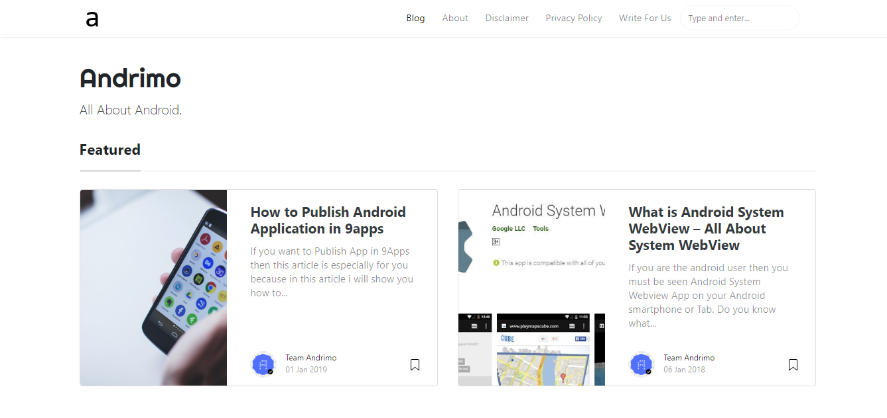

---
layout: page
title: About - Andrimo
permalink: /about
comments: false
css: main.scss
---  

# Andrimo - All About Android

### Details

[Website](https://www.andrimo.com/) &nbsp; | &nbsp; [How to Edit Andrimo Article](https://www.andrimo.com/edit-andrimo-article) &nbsp; | &nbsp; [About](https://www.andrimo.com/about) &nbsp; |

Inspired By [Microsoft Documentation](https://docs.microsoft.com)

Important CSS code 

 A kind of a notice box !
 

 Error message
 

 A positive/success/completion message
 

 A warning message

### Copyright

Copyright (C) 2019 Andrimo, https://www.andrimo.com

Andrimo used this design under MIT license. 

Thank you!
